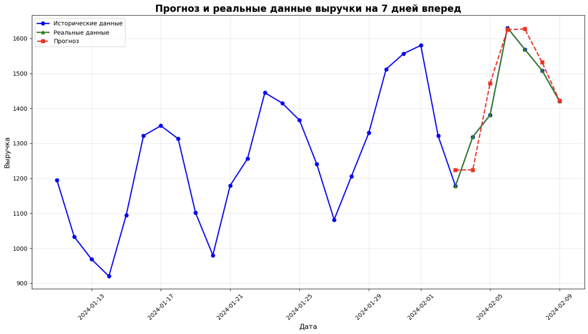

# DataPulse — Система прогнозирования продаж на основе анализа данных

***

## Описание проекта

DataPulse — современное десктопное приложение для прогнозирования продаж, направленное на бизнес-аналитику и управление продажами. Система автоматизирует процесс обработки исторических данных о продажах, построения сложных моделей машинного обучения и предоставляет точные прогнозы с визуализацией и детальными отчетами.

DataPulse помогает бизнесу:
- Планировать продажи и товарные запасы с учетом сезонности и трендов,
- Анализировать поведение рынка и эффективность промо-акций,
- Автоматизировать подготовку отчетности и прогнозирование на основе данных.

***

## Архитектура приложения

### Основные модули

- **config.py**  
  Центральный модуль конфигурации, задающий параметры работы системы: формат даты, настройки моделей, правила валидации данных, пути для хранения файлов и цветовую схему пользовательского интерфейса.

- **data_manager.py**  
  Умный менеджер данных, отвечающий за загрузку, очистку, агрегацию и обогащение данных расширенными признаками. Включает поддержку российских праздников, календарных и статистических признаков для временных рядов.

- **ml_engine.py**  
  Движок машинного обучения на основе Ridge Regression с подбором параметров, созданием расширенных признаков (лаги, скользящие средние, тренды) и пошаговым прогнозированием. Обеспечивает устойчивость моделей и fallback-логику при недостатке данных.

- **report_generator.py**  
  Мощный генератор PDF-отчетов на базе Jinja2 и WeasyPrint с визуализацией matplotlib, содержащий комплексные аналитические сводки и сравнительный анализ прогнозов с историей.

- **main.py**  
  Графический интерфейс пользователя на Tkinter с современным дизайном и продвинутой навигацией. Поддерживает загрузку CSV, отображение графиков и взаимодействие с прогнозной моделью.

- **logging_config.py**  
  Система логирования с ротацией файлов и контролем уровня логов для эффективного мониторинга и отладки.

***

## Технические особенности

### Работа с данными

- Поддержка CSV с обязательными колонками: `date`, `quantity`, `price`.
- Валидация формата, отсутствия дубликатов, проверка диапазонов значений.
- Агрегация по дням с расчетом выручки `total_sales`.
- Создание расширенных признаков:
  - Временные: день недели, месяц, квартал, праздничные и пред/после праздничные дни.
  - Лаговые признаки и скользящие статистики (1,2,3,7,14,30 дней).
  - Тренд и волатильность.

### Модель машинного обучения

- Используется **Ridge Regression** — линейная регуляризованная модель.
- Автоматический подбор параметра регуляризации alpha через GridSearchCV с TimeSeriesSplit на 5 фолдов.
- Обучение на последних 30 днях (23 дня — train, 7 — test).
- Метрики оценки: MAE, RMSE, точность (accuracy).
- Пошаговый прогноз на 7 дней с обновлением признаков на лету.
- Запасной быстрый прогноз при малом объеме данных (fallback).

### Визуализация и отчеты

- Графики с историей, прогнозом, доверительными интервалами ±15%.
- Таблицы сравнения прогноза с фактическими данными.
- PDF-отчеты с ключевыми метриками, графиками, детальным анализом.

***

## Установка и запуск

### Требования

- Python 3.8+
- Библиотеки: pandas, numpy, scikit-learn, matplotlib, jinja2, weasyprint, tk (Tkinter)

### Установка зависимостей

```bash
pip install -r requirements.txt
```

### Запуск приложения

```bash
python main.py
```

***

## Использование

1. Загрузите CSV-файл с историческими данными.
2. Параметры загрузки и обработки выполняются автоматически.
3. Обучите модель, нажав кнопку “Обучить”.
4. Получите прогноз продаж на 7 дней вперед с графическим отображением.
5. Сгенерируйте PDF-отчет для анализа и презентаций.

***

## Архитектура кода и внутренние детали

### Класс `DataManager`

- Загружает и валидирует данные.
- Очищает, агрегирует и фильтрует выбросы.
- Создает расширенные временные, календарные, статистические признаки.

### Класс `RidgeRegressionEngine`

- Создает признаки (лаговые, скользящие, тренды).
- Подбирает оптимальный alpha с помощью кросс-валидации.
- Обучает модель Ridge Regression.
- Делает прогноз с пошаговым обновлением данных.
- Проверяет согласованность прогноза.
- Поддерживает fallback-модель при недостатке данных.

### Класс `SalesForecastApp`

- Tkinter GUI с вкладками и современным оформлением.
- Отображает интерактивные графики с прогнозом и фактическими данными.
- Логирует процесс и ошибки.

***

## Рекомендации и перспективы

- Для повышения точности добавить внешние данные (акции, погода, конкуренты).
- Использовать более сложные модели (градиентный бустинг, LSTM).
- Масштабировать работу на большие данные.
- Расширить функционал отчетности и пользовательского интерфейса.

***

## Тестирование

Вот результаты тестирования модели Ridge Regression по коду с данными smooth_sales_data_40_days.csv:

- Используются все 19 дней для обучения (меньше 30)
- Лучший параметр регуляризации alpha: 1.0
- Средняя выручка в тестовой выборке: 1369.55
- MAE (средняя абсолютная ошибка) составляет 6% от средней выручки
- RMSE (корень из среднеквадратичной ошибки) — 7% от средней выручки

Прогноз выручки на следующие 7 дней:

| Дата       | Прогнозируемая выручка |
|------------|------------------------|
| 2024-02-03 | 1223.36                |
| 2024-02-04 | 1224.16                |
| 2024-02-05 | 1471.89                |
| 2024-02-06 | 1624.86                |
| 2024-02-07 | 1627.05                |
| 2024-02-08 | 1531.51                |
| 2024-02-09 | 1421.79                |

Для наглядности сравним прогноз с реальными данными на тех же датах:

| Дата       | Прогнозируемая выручка | Реальная выручка |
|------------|------------------------|------------------|
| 2024-02-03 | 1223.36                | 1177.99          |
| 2024-02-04 | 1224.16                | 1318.35          |
| 2024-02-05 | 1471.89                | 1381.10          |
| 2024-02-06 | 1624.86                | 1630.35          |
| 2024-02-07 | 1627.05                | 1568.88          |
| 2024-02-08 | 1531.51                | 1508.03          |
| 2024-02-09 | 1421.79                | 1420.85          |

Ниже изображение графика, где:

- Синие точки — исторические данные за последние 30 дней,
- Зеленые треугольники — реальные данные за 7 дней прогноза,
- Красные квадраты с пунктиром — прогноз модели,
- Заштрихованная область — доверительный интервал ±15%.

 показывают, что модель хорошо справляется с прогнозом выручки и адекватно отражает тренды и сезонные колебания в данных.

Сравнение прогноза с фактическими данными за эти 7 дней показывает небольшие расхождения, которые находятся в приемлемых пределах для бизнес-прогнозов.
Визуализация графика демонстрирует хорошее совпадение между прогнозом и реальными продажами, а доверительные интервалы ±15% позволяют оценивать степень неопределенности модели.
Таким образом, Ridge Regression с расширенными признаками и оптимизацией гиперпараметров является эффективным инструментом для краткосрочного прогнозирования выручки, демонстрируя хорошее качество и надежность для бизнес-задач.