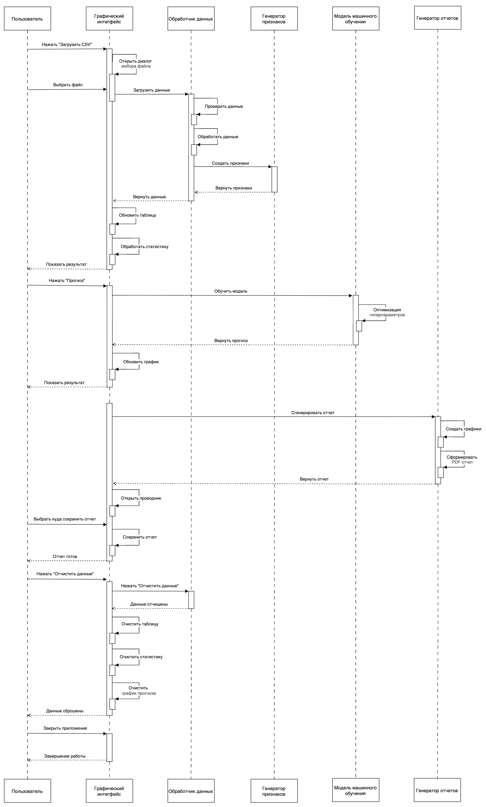
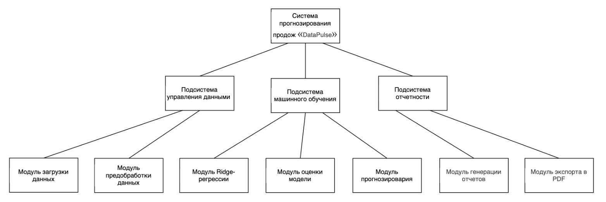
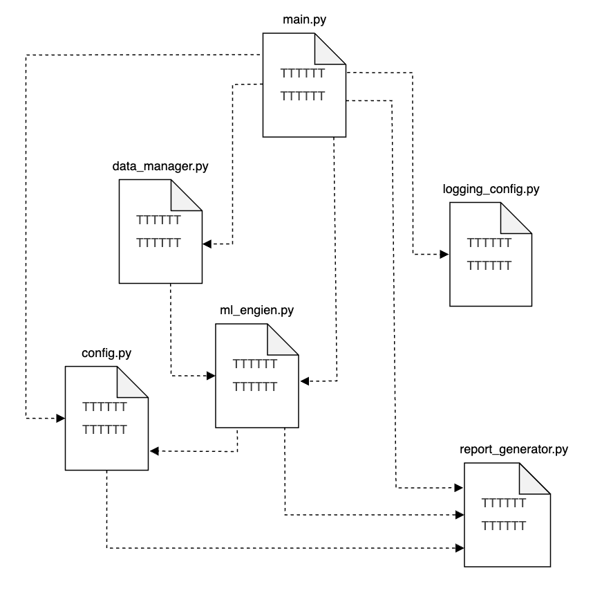
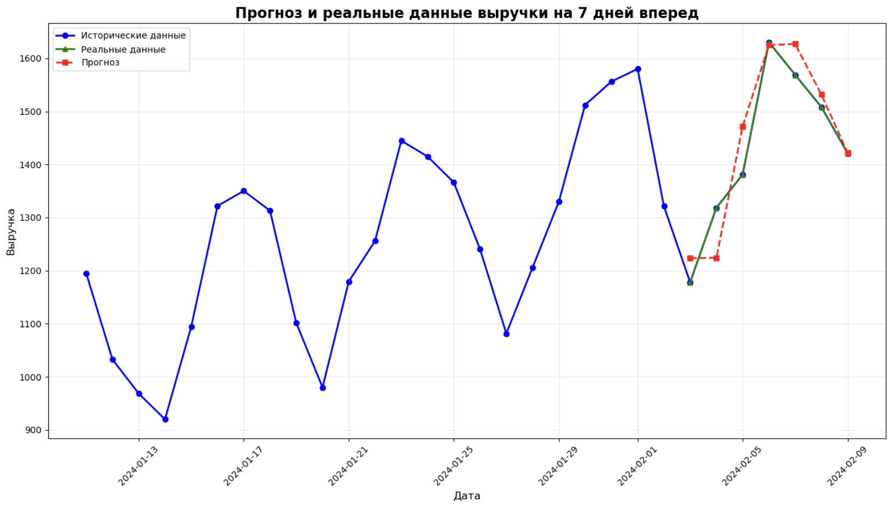

# DataPulse — Система прогнозирования продаж на основе анализа данных


## Оглавление
- [Описание проекта](#описание-проекта)<br>
- [Ключевые возможности](#ключевые-возможности) <br>
- [Архитектура приложения](#архитектура-приложения) <br>
- [Технические особенности](#технические-особенности) <br>
- [Установка и запуск](#установка-и-запуск) <br>
- [Использование](#использование) <br>
- [Тестирование и результаты](#тестирование-и-результаты) <br>
- [Документация](#документация)<br>
- [Авторы и лицензия](#авторы-и-лицензия)<br>

## Описание проекта

**DataPulse** — современное десктопное приложение для прогнозирования продаж, разработанное как курсовая работа по дисциплине "Технология разработки программных систем" в МГТУ им. Н.Э. Баумана. Система автоматизирует процесс обработки исторических данных о продажах, построения моделей машинного обучения и предоставляет точные прогнозы с визуализацией и детальными отчетами.

**DataPulse помогает бизнесу:**
- Планировать продажи и товарные запасы с учетом сезонности и трендов,
- Анализировать поведение рынка и эффективность промо-акций,
- Автоматизировать подготовку отчетности и прогнозирование на основе данных.

## Ключевые возможности

| Функция | Описание |
|---------|----------|
| **Загрузка данных** | Импорт исторических данных из CSV-файлов |
| **Валидация данных** | Проверка формата, целостности и корректности данных |
| **Машинное обучение** | Прогнозирование на основе Ridge-регрессии |
| **Визуализация** | Графики с историей, прогнозом и доверительными интервалами |
| **Генерация отчетов** | Автоматическое создание PDF-отчетов |
| **GUI интерфейс** | Интуитивный графический интерфейс на Tkinter |

## Архитектура приложения

### Диаграмма последовательности
На диаграмме последовательности показано взаимодействие между компонентами системы при выполнении ключевых операций:



*Диаграмма демонстрирует поэтапный обмен сообщениями между участниками системы при:*
- *Загрузке данных и валидации CSV-файлов*
- *Обучении модели и выполнении прогноза*
- *Генерации отчетов в PDF-формате*
- *Очистке данных и завершении работы*
---
### Схема структурная программного продукта «DataPulse» 

---
### Основные модули
Диаграмма компоновки приложения «DataPulse»


- **`config.py`** — Центральный модуль конфигурации, задающий параметры работы системы: формат даты, настройки моделей, правила валидации данных, пути для хранения файлов и цветовую схему пользовательского интерфейса.

- **`data_manager.py`** — Умный менеджер данных, отвечающий за загрузку, очистку, агрегацию и обогащение данных расширенными признаками. Включает поддержку российских праздников, календарных и статистических признаков для временных рядов.

- **`ml_engine.py`** — Движок машинного обучения на основе Ridge Regression с подбором параметров, созданием расширенных признаков (лаги, скользящие средние, тренды) и пошаговым прогнозированием. Обеспечивает устойчивость моделей и fallback-логику при недостатке данных.

- **`report_generator.py`** — Мощный генератор PDF-отчетов на базе Jinja2 и WeasyPrint с визуализацией matplotlib, содержащий комплексные аналитические сводки и сравнительный анализ прогнозов с историей.

- **`main.py`** — Графический интерфейс пользователя на Tkinter с современным дизайном и продвинутой навигацией. Поддерживает загрузку CSV, отображение графиков и взаимодействие с прогнозной моделью.

- **`logging_config.py`** — Система логирования с ротацией файлов и контролем уровня логов для эффективного мониторинга и отладки.

## Технические особенности

### Работа с данными
- Поддержка CSV с обязательными колонками: `date`, `quantity`, `price`
- Валидация формата, отсутствия дубликатов, проверка диапазонов значений
- Агрегация по дням с расчетом выручки `total_sales`
- Создание расширенных признаков:
  - Временные: день недели, месяц, квартал, праздничные и пред/после праздничные дни
  - Лаговые признаки и скользящие статистики (1,2,3,7,14,30 дней)
  - Тренд и волатильность

### Модель машинного обучения
- Используется **Ridge Regression** — линейная регуляризованная модель
- Автоматический подбор параметра регуляризации alpha через GridSearchCV с TimeSeriesSplit на 5 фолдов
- Метрики оценки: MAE, RMSE
- Пошаговый прогноз на 7 дней

### Визуализация и отчеты
- Графики с историей, прогнозом, доверительными интервалами ±15%
- Таблицы сравнения прогноза с фактическими данными
- PDF-отчеты с ключевыми метриками, графиками, детальным анализом

## Установка и запуск

### Установка зависимостей

```bash
# Клонирование репозитория
git clone https://github.com/kira-light/DataPulse
cd DataPulse

# Создание виртуального окружения
python -m venv venv

# Активация виртуального окружения
source venv/bin/activate

# Установка зависимостей
pip install -r requirements.txt
```

### Запуск приложения

```bash
python main.py
```

## Использование

### Пошаговое руководство
1. **Загрузка данных** — нажмите кнопку "Загрузить CSV" и выберите файл с историческими данными
2. **Просмотр данных** — проверьте загруженную информацию во вкладке "Данные"
3. **Прогнозирование** — нажмите "Обучить и спрогнозировать" для построения прогноза
4. **Анализ результатов** — изучите прогноз во вкладке "Прогноз" и статистику во вкладке "Статистика"
5. **Генерация отчетов** — создайте PDF-отчет с результатами анализа

### Формат входных данных
CSV-файл должен содержать следующие обязательные колонки:
- `date` — дата продажи в формате ГГГГ-ММ-ДД (например, 2024-01-15)
- `quantity` — количество проданных единиц товара (целое положительное число)
- `price` — цена за единицу товара (положительное число)

**Пример CSV-файла:**
```csv
date,quantity,price
2024-01-01,10,1000
2024-01-02,15,950
2024-01-03,8,1100
```

**Требования к данным:**
- Минимальное количество записей: 30
- Максимальный размер файла: 50 МБ
- Количество товара: от 0 до 1 000 000 единиц
- Цена товара: от 0 до 10 000 000 рублей

## Тестирование и результаты

### Метрики качества модели
Система была протестирована на исторических данных объемом 40 дней:

| Метрика | Значение | Интерпретация |
|---------|----------|---------------|
| **MAE (Mean Absolute Error)** | 5% от средней выручки | Высокая точность прогноза |
| **RMSE (Root Mean Square Error)** | 7% от средней выручки | Хорошее качество модели |
| **Средняя выручка** | 1429.37 руб. | Базовый показатель |
| **Лучший параметр alpha** | 1.0 | Оптимальная регуляризация |

### Сравнение прогноза с фактическими данными

| Дата | Прогнозируемая выручка, руб. | Фактическая выручка, руб. | Отклонение, % |
|------|------------------------------|---------------------------|---------------|
| 2024-02-03 | 1223.36 | 1177.99 | +3.85 |
| 2024-02-04 | 1224.16 | 1318.35 | -7.14 |
| 2024-02-05 | 1471.89 | 1381.10 | +6.57 |
| 2024-02-06 | 1624.86 | 1630.35 | -0.34 |
| 2024-02-07 | 1627.05 | 1568.88 | +3.71 |
| 2024-02-08 | 1531.51 | 1508.03 | +1.56 |
| 2024-02-09 | 1421.79 | 1420.85 | +0.07 |

### Визуализация результатов



**На графике представлены:**
- 🔵 **Синие точки** — исторические данные за последние 30 дней
- 🟢 **Зеленые треугольники** — реальные данные за 7 дней прогноза
- 🔴 **Красные квадраты** — прогноз модели

**Выводы тестирования:**
- Модель хорошо справляется с прогнозом выручки и корректно отражает тренды и сезонные колебания
- Расхождения между прогнозом и фактическими данными находятся в приемлемых пределах
- Доверительные интервалы ±15% позволяют оценивать степень неопределенности модели
- Ridge Regression с расширенными признаками демонстрирует хорошее качество и надежность для бизнес-задач


## Документация

### Полная документация проекта
- **Расчетно-пояснительная записка** — полное описание системы, архитектуры, алгоритмов и результатов тестирования
- **Техническое задание** — требования к системе, функциональные характеристики, этапы разработки
- **Руководство пользователя** — подробные инструкции по установке и использованию системы
- **Исходный код** — листинги всех программных модулей с комментариями

### Диаграммы и схемы (включены в РПЗ)
1. **Диаграмма вариантов использования** — взаимодействие пользователя с системой
2. **Диаграмма деятельности** — бизнес-процессы и последовательность операций
3. **Диаграмма последовательности** — временные аспекты взаимодействия компонентов
4. **Структурная схема** — состав системы и внутренние взаимодействия
5. **Диаграмма компоновки** — физическая организация компонентов
6. **Диаграмма классов** — ключевые сущности системы и отношения между ними
7. **Граф состояний интерфейса** — состояния пользовательского интерфейса и переходы
8. **Формы интерфейса** — визуальное представление всех экранов приложения

## Авторы и лицензия

**Кальвинскайте Кира Владимировна** — разработка, тестирование, документация


### Учебное заведение
**МГТУ им. Н.Э. Баумана**  
Факультет: Информатика и системы управления  
Кафедра: Компьютерные системы и сети (ИУ6)  
Направление подготовки: 09.03.01 Информатика и вычислительная техника  
Дисциплина: Технология разработки программных систем

### Лицензия
Этот проект распространяется под лицензией MIT. Подробнее см. в файле [LICENSE](LICENSE).

---

**DataPulse** представляет собой программное решение для прогнозирования продаж, которое успешно прошло все этапы разработки и тестирования. Система демонстрирует высокую точность прогнозирования, интуитивный интерфейс и готовность к использованию в бизнес-среде.


*Разработано в рамках курсовой работы по дисциплине "Технология разработки программных систем"*  
*Москва, МГТУ им. Н.Э. Баумана, 2025 год*
